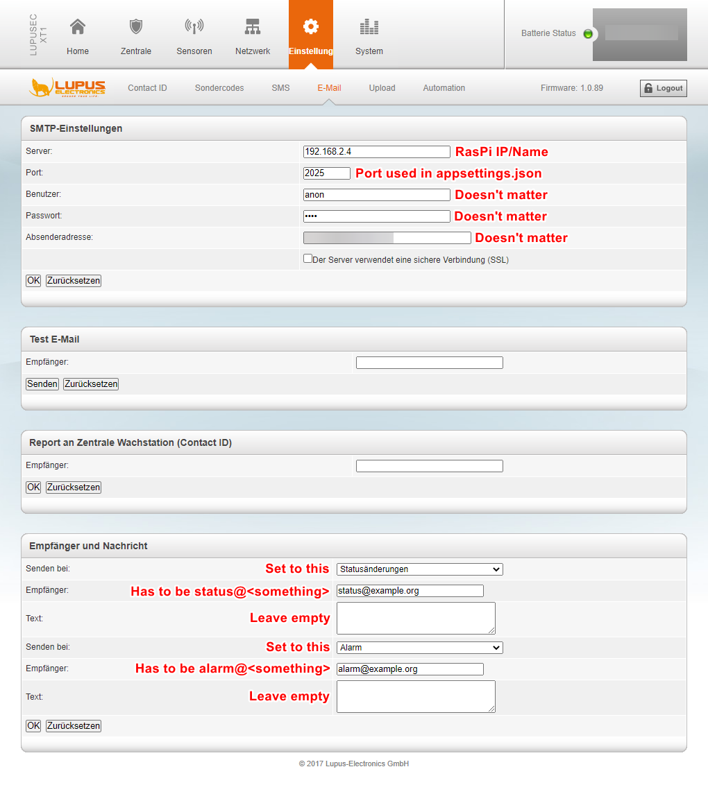
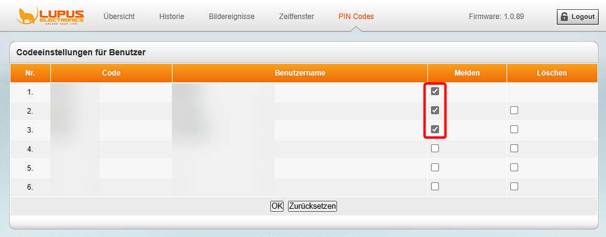

# LupuServ

[](https://github.com/nefarius/LupuServ/actions/workflows/dotnet.yml)

E-Mail to SMS Gateway service for Lupusec XT1 alarm system

## Motivation

I happened to know an owner of the very early central alarm system Lupusec XT1 from the German company [Lupus Electronics](https://www.lupus-electronics.de/en/), which has been declared End Of Life several years ago and doesn't receive firmware updates anymore. It appears, that the manufacturer isn't particularly proud of this early revision, as it has become impossible to find resources about it on the company websites (except for the **XT1 Plus** which is *not* the system I'm talking about, but a newer platform).

The system offers a few methods of notifying the outside world about an alarm event, the one in question being able to send a classic SMS message to a maximum of two phone numbers. APIs tend to change or become deprecated, and without firmware updates there isn't much one can do. Which is exactly what happened here; the SMS gateway implementation broke and thanks to this thing not provide any logs or sources, who knows why. This leaves us with a few different channels to grab events from: Contact-ID - which I have no idea what that is and what to do with it - and E-Mail.

I decided to abuse the E-Mail functionality to receive alarm (and status change) events by faking an SMTP-Server, which in turn transforms the mail body and sends it to an SMS gateway in proxy. The application uses .NET 7.0 and is designed as a Worker compatible with Docker, so it should run on any supported Linux system.

## Supported Systems

The solution has been developed for and tested with the Lupusec XT1 (**not** Plus!) central station running Firmware version **1.0.89** and LupuServ hosted on a Raspberry Pi 2 Model B Rev 1.1 (ARM32). The only SMS gateway provider implemented is [CM.com](https://www.cm.com/about-cm/) so you need a registered account and a minimum balance required for the Messaging gateway channel.

## Features

- Can send messages to more than two recipients (limit of original firmware)
- Stores status changes and alarm events in any MongoDB-compatible database
  - The example compose file uses [FerretDB](https://github.com/FerretDB/FerretDB) with the [SQLite](https://www.sqlite.org/index.html) backend
  - This way you can automatically keep a log e.g. off-site on what's going on in the monitored premises

## Limitations

Some shortcuts have been taken on purpose while developing this proxy application. As of now I have no plans to rectify them or focus on additional features.

- SMTP-Server doesn't use authentication, it accepts any username and password
  - This solution is meant to be operated in a firewall-protected private network, and without forced TLS protection plaintext authentication is a useless "security" measure anyway. It can be added quite easily though, consult the documentation of the SMTP library.
- SMS gateway failures are logged, but no other notification happens
  - SMS delivery errors can occur, like if the credit of the used account is depleted, this should be delivered to technical personnel via some way.
- Basic rate limits to mitigate SMS-bombing
  - There's a rate limit in place for alarm mails to protect against unintended message spam. A shortcoming of the current implementation is that once the rate limit is hit, the message is dropped and not re-sent.

## How to build

Here's an example using my own tag (adapt accordingly) and [Podman](https://podman.io/) instead of Docker. Since I plan on running the service on a Raspberry Pi 2 Model B Rev 1.1 (ARM32) and build on Windows amd64 we need to specify the correct target platform:

```bash
podman build --platform linux/arm/v7 -t nefarius.azurecr.io/lupuserv:latest .
podman push nefarius.azurecr.io/lupuserv:latest
```

Since the Raspberry Pi has limited computing power, I prefer to build the image on my main PC and just download and run it on the Pi.

## How to set up

You can choose one of the supported SMS Gateway Providers outlined below:

<details>

<summary>Using CM.com</summary>

- Register an account with [CM.com](https://www.cm.com/)
  - Don't forget to respond to verification SMS and mail
  - Add a balance of at least 15€ (as of time of writing) to unlock the Messaging gateway channel (which allows sending messages)
  - Get the Product token/API key for the Messaging gateway

</details>

<details>

<summary>Using ClickSend</summary>

- Register an account with [ClickSend](https://www.clicksend.com/eu/)
  - Get the API Credentials (Username and Token) by clicking the key icon on the top right of your Dashboard

</details>

- Build and deploy this solution to a system of your choice
  - For example, install Docker CE on a Raspberry Pi 2 and use the provided compose file to permanently run it as a container. There's plenty documentation out there on how to do that so I will not go into details here.
    1) Rename `docker-compose.example.yml` to `docker-compose.yml` and adjust its content accordingly
    2) Rename `appsettings.example.json` to `appsettings.json` and adjust content according to your environment
    3) Run: `docker-compose up -d`
- Configure the E-Mail settings on the XT1 web interface as shown below (I only had access to a German UI so it might look different on your system):
  
- You can use the Test E-Mail function and should be able to see it appear in the logs
- **Optional:** to get Arm/Home/Disarm events sent as status messages you need to explicitly enable them in the PIN Codes settings:  
  

## Sources & 3rd party credits

This application benefits from these awesome projects ❤ (appearance in no special order):

- [CM Text SDK](https://github.com/cmdotcom/text-sdk-dotnet)
- [MimeKit](https://github.com/jstedfast/MimeKit)
- [SmtpServer](https://github.com/cosullivan/SmtpServer)
- [Polly](https://github.com/App-vNext/Polly#rate-limit)
- [MongoDB.Entities](https://mongodb-entities.com/)
- [FerretDB](https://www.ferretdb.io/)
- [Refit](https://github.com/reactiveui/refit)

### References

- [LUPUSEC XT1 Handbuch](https://archive.org/details/manualzilla-id-6737868/)
- [BuildX for arm64 on .Net 7.0 is broken](https://github.com/dotnet/sdk/issues/28971#issuecomment-1308881150)
- [ClickSend API - Send SMS](https://developers.clicksend.com/docs/rest/v3/?csharp#send-sms)
